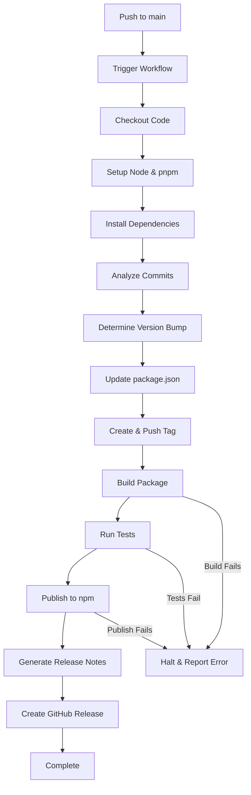

# Design Document: Automated NPM Publishing

## Overview

This design implements an automated npm publishing workflow using GitHub Actions. The workflow triggers on pushes to the main branch, automatically determines the version bump using conventional commits, updates package.json, creates a git tag, builds and tests the package, publishes to npm, and creates a GitHub release with generated release notes.

The solution uses a single GitHub Actions workflow file that orchestrates all steps sequentially, with proper error handling and security measures.

## Architecture

### High-Level Flow



### Components

1. **Commitlint Configuration**: Enforces conventional commit format on all commits
2. **GitHub Actions Workflow**: Orchestrates the entire publishing process
3. **Version Analyzer**: Parses commits to determine version bump type (uses conventional commits)
4. **Package Updater**: Modifies package.json with new version
5. **Git Tagger**: Creates and pushes version tags
6. **Build & Test Runner**: Executes build and test commands
7. **NPM Publisher**: Authenticates and publishes to npm registry
8. **Release Notes Generator**: Creates formatted release notes from conventional commits
9. **GitHub Release Creator**: Creates releases with notes and metadata

## Components and Interfaces

### 1. Commitlint Configuration

**Purpose**: Enforce conventional commit message format to ensure consistent commit history and enable automated release notes

**Files**:
- `.commitlintrc.json`: Commitlint configuration
- `.husky/commit-msg`: Git hook to run commitlint on commit messages

**Configuration**:
```json
{
  "extends": ["@commitlint/config-conventional"],
  "rules": {
    "type-enum": [
      2,
      "always",
      [
        "feat",
        "fix",
        "docs",
        "style",
        "refactor",
        "perf",
        "test",
        "build",
        "ci",
        "chore",
        "revert"
      ]
    ],
    "subject-case": [2, "never", ["upper-case"]],
    "subject-empty": [2, "never"],
    "subject-full-stop": [2, "never", "."],
    "type-case": [2, "always", "lower-case"],
    "type-empty": [2, "never"]
  }
}
```

**Commit Format**:
```
<type>[optional scope]: <description>

[optional body]

[optional footer(s)]
```

**Examples**:
- `feat: add automated release workflow`
- `fix: correct version bump calculation`
- `feat!: redesign API (breaking change)`
- `fix(parser): handle empty commit messages`

**Benefits**:
- Ensures all commits follow conventional format
- Enables accurate version bump determination
- Improves release notes quality
- Provides clear commit history

**Integration**:
- Husky git hooks run commitlint before commit is created
- CI workflow can also validate commit messages
- Developers get immediate feedback on commit message format

### 2. GitHub Actions Workflow Configuration

**File**: `.github/workflows/publish.yml`

**Trigger Configuration**:
```yaml
on:
  push:
    branches:
      - main
```

**Permissions**:
```yaml
permissions:
  contents: write  # For creating tags and releases
  packages: write  # For publishing
```

**Environment**:
- Node.js: 18.x or higher (from package.json engines)
- Package Manager: pnpm
- Runner: ubuntu-latest

### 3. Version Analyzer

**Purpose**: Analyze conventional commit messages to determine semantic version bump

**Input**: 
- Conventional commit messages since last tag (validated by commitlint)
- Current version from package.json

**Output**:
- Version bump type: major | minor | patch
- New version number

**Logic**:
```
function determineVersionBump(commits):
  hasMajor = false
  hasMinor = false
  hasPatch = false
  
  for each commit in commits:
    if commit contains "BREAKING CHANGE:" or "!" after type:
      hasMajor = true
    else if commit type is "feat":
      hasMinor = true
    else if commit type is "fix":
      hasPatch = true
  
  if hasMajor:
    return "major"
  else if hasMinor:
    return "minor"
  else:
    return "patch"  // default for other types (docs, chore, etc.)
```

**Implementation**: Use `semantic-release` or `standard-version` which have built-in conventional commit parsing

**Recommended Tool**: `semantic-release`
- Automatically determines version bump from conventional commits
- Generates changelog
- Creates git tags
- Publishes to npm
- Creates GitHub releases
- Highly configurable and widely adopted

### 4. Package Updater

**Purpose**: Update package.json with new version

**Input**:
- New version number
- Path to package.json

**Output**:
- Modified package.json file

**Implementation Options**:
- Use `npm version` command: `npm version <newversion> --no-git-tag-version`
- Direct JSON manipulation with `jq` or Node.js script

**Chosen Approach**: Use `npm version` for reliability and standard compliance

### 5. Git Tagger

**Purpose**: Create version tag and push to repository

**Input**:
- New version number
- Commit message

**Output**:
- Git commit with updated package.json
- Git tag (format: vX.Y.Z)
- Pushed changes to remote

**Configuration**:
```bash
git config user.name "github-actions[bot]"
git config user.email "github-actions[bot]@users.noreply.github.com"
git add package.json
git commit -m "chore: bump version to v${NEW_VERSION}"
git tag "v${NEW_VERSION}"
git push origin main --tags
```

**Security**: Uses `GITHUB_TOKEN` for authentication

### 6. Build & Test Runner

**Purpose**: Execute build and test commands to validate package

**Build Command**: `pnpm build`
- Compiles TypeScript to JavaScript
- Outputs to `dist/` directory
- Generates type definitions

**Test Command**: `pnpm test`
- Runs vitest test suite
- Must pass all tests to proceed

**Error Handling**: 
- If build fails: halt workflow, report error
- If tests fail: halt workflow, report error
- Exit codes propagate to workflow

### 7. NPM Publisher

**Purpose**: Authenticate with npm and publish package

**Authentication**:
- Uses `NPM_TOKEN` from GitHub secrets
- Configured via `.npmrc` file or environment variable

**Publish Command**: `npm publish --access public`

**Validation**:
- Checks if version already exists (npm will error)
- Verifies package.json has correct version
- Ensures dist/ directory exists

**Configuration**:
```bash
echo "//registry.npmjs.org/:_authToken=${NPM_TOKEN}" > ~/.npmrc
npm publish --access public
```

### 8. Release Notes Generator

**Purpose**: Generate formatted release notes from conventional commits

**Input**:
- Conventional commits between previous tag and current tag (validated by commitlint)
- PR information (if available)

**Output**:
- Markdown-formatted release notes (CHANGELOG.md format)

**Format**:
```markdown
## [2.1.0](https://github.com/owner/repo/compare/v2.0.0...v2.1.0) (2024-01-15)

### Features

* add automated release workflow ([abc123](commit-url)) ([#42](pr-url))
* support pre-release versions ([def456](commit-url))

### Bug Fixes

* correct version bump calculation ([ghi789](commit-url)) ([#43](pr-url))

### BREAKING CHANGES

* API redesign requires migration ([jkl012](commit-url))
```

**Implementation**: Use `semantic-release` with `@semantic-release/changelog` plugin

**Categorization Rules** (from conventional commits):
- `feat:` → Features
- `fix:` → Bug Fixes
- `BREAKING CHANGE:` or `!` → Breaking Changes
- `docs:` → Documentation
- `perf:` → Performance Improvements
- `revert:` → Reverts
- `chore:`, `ci:`, `test:`, `build:`, `style:`, `refactor:` → Not included in release notes (internal changes)

**Benefits of semantic-release**:
- Automatically parses conventional commits
- Generates consistent, well-formatted changelogs
- Links to commits and PRs
- Groups changes by type
- Includes version comparison links

### semantic-release Configuration

**File**: `.releaserc.json`

```json
{
  "branches": ["main"],
  "plugins": [
    "@semantic-release/commit-analyzer",
    "@semantic-release/release-notes-generator",
    "@semantic-release/changelog",
    "@semantic-release/npm",
    [
      "@semantic-release/git",
      {
        "assets": ["package.json", "CHANGELOG.md"],
        "message": "chore(release): ${nextRelease.version} [skip ci]\n\n${nextRelease.notes}"
      }
    ],
    "@semantic-release/github"
  ]
}
```

**Plugin Responsibilities**:
- `@semantic-release/commit-analyzer`: Determines version bump from commits
- `@semantic-release/release-notes-generator`: Generates release notes
- `@semantic-release/changelog`: Updates CHANGELOG.md file
- `@semantic-release/npm`: Publishes to npm registry
- `@semantic-release/git`: Commits version changes back to repository
- `@semantic-release/github`: Creates GitHub releases

**Required Dependencies**:
```json
{
  "devDependencies": {
    "semantic-release": "^22.0.0",
    "@semantic-release/changelog": "^6.0.3",
    "@semantic-release/commit-analyzer": "^11.0.0",
    "@semantic-release/git": "^10.0.1",
    "@semantic-release/github": "^9.0.0",
    "@semantic-release/npm": "^11.0.0",
    "@semantic-release/release-notes-generator": "^12.0.0"
  }
}
```

### 9. GitHub Release Creator

**Purpose**: Create GitHub release with notes and metadata

**Input**:
- Tag name (vX.Y.Z)
- Release notes (markdown)
- Pre-release flag (optional)

**Output**:
- Published GitHub release

**Configuration**:
- Release title: `v${VERSION}`
- Tag: `v${VERSION}`
- Body: Generated release notes
- Pre-release: true if version contains `-alpha`, `-beta`, `-rc`
- Latest: true (unless pre-release)

**Implementation**: Use `actions/create-release` or GitHub CLI (`gh release create`)

## Data Models

### Workflow State

```typescript
interface WorkflowState {
  currentVersion: string;      // From package.json
  commits: Commit[];           // Since last tag
  versionBump: 'major' | 'minor' | 'patch';
  newVersion: string;          // Calculated version
  tagName: string;             // Format: vX.Y.Z
  buildSuccess: boolean;
  testSuccess: boolean;
  publishSuccess: boolean;
  releaseNotes: string;
}
```

### Commit Information

```typescript
interface Commit {
  sha: string;
  message: string;
  author: string;
  timestamp: string;
  prNumber?: number;
}
```

### Version Information

```typescript
interface Version {
  major: number;
  minor: number;
  patch: number;
  prerelease?: string;
  
  toString(): string;  // Returns vX.Y.Z format
  bump(type: 'major' | 'minor' | 'patch'): Version;
}
```

### Release Notes Structure

```typescript
interface ReleaseNotes {
  version: string;
  features: string[];
  bugFixes: string[];
  breakingChanges: string[];
  otherChanges: string[];
  compareUrl: string;
  
  toMarkdown(): string;
}
```

## Workflow Steps (Detailed)

### Recommended Approach: semantic-release

The most robust approach is to use `semantic-release`, which handles all version management, changelog generation, and publishing automatically based on conventional commits.

**semantic-release workflow**:
1. Analyzes commits since last release
2. Determines version bump type
3. Generates changelog
4. Updates package.json version
5. Creates git tag
6. Publishes to npm
7. Creates GitHub release

### Step 1: Trigger and Setup
1. Workflow triggers on push to main
2. Checkout repository with full history (`fetch-depth: 0`)
3. Setup Node.js (version 18.x)
4. Setup pnpm
5. Install dependencies (`pnpm install`)

### Step 2: Validation (Optional but Recommended)
1. Run commitlint on recent commits to ensure conventional format
2. Verify all commits follow conventional commit standard

### Step 3: Automated Release with semantic-release
1. Run `npx semantic-release`
2. semantic-release automatically:
   - Analyzes commits since last tag
   - Determines version bump (major/minor/patch)
   - Updates package.json version
   - Generates CHANGELOG.md
   - Runs build and test (via prepare/prepublishOnly scripts)
   - Creates git tag
   - Pushes tag to repository
   - Publishes to npm
   - Creates GitHub release with changelog

### Alternative: Manual Steps (if not using semantic-release)

If implementing manually without semantic-release:

#### Step 2: Version Determination
1. Fetch all tags
2. Get latest tag (or use v0.0.0 if none)
3. Get commits since last tag
4. Analyze commit messages for conventional commit types
5. Determine version bump type
6. Read current version from package.json
7. Calculate new version

#### Step 3: Version Update and Tagging
1. Run `npm version <newversion> --no-git-tag-version`
2. Configure git user
3. Commit package.json change
4. Create git tag
5. Push commit and tag to origin

#### Step 4: Build and Test
1. Run `pnpm build`
2. Verify dist/ directory exists
3. Run `pnpm test`
4. Verify all tests pass

#### Step 5: NPM Publishing
1. Configure npm authentication
2. Run `npm publish --access public`
3. Verify publish success

#### Step 6: Release Creation
1. Generate release notes from commits
2. Create GitHub release with:
   - Tag name
   - Release title
   - Release notes body
   - Pre-release flag (if applicable)

#### Step 7: Cleanup and Notification
1. Report workflow status
2. Update commit status
3. Log completion

## Error Handling

### Build Failures
- **Detection**: Non-zero exit code from `pnpm build`
- **Action**: Halt workflow, mark as failed
- **Message**: "Build failed - see logs for details"
- **Recovery**: Developer fixes build issues and pushes again

### Test Failures
- **Detection**: Non-zero exit code from `pnpm test`
- **Action**: Halt workflow, mark as failed
- **Message**: "Tests failed - see logs for details"
- **Recovery**: Developer fixes tests and pushes again

### Publish Failures
- **Detection**: Non-zero exit code from `npm publish`
- **Common Causes**:
  - Version already exists
  - Authentication failure
  - Network issues
- **Action**: Halt workflow, mark as failed
- **Message**: Include npm error output
- **Recovery**: 
  - If version exists: manually increment version
  - If auth failure: check NPM_TOKEN secret
  - If network: retry workflow

### Tag Conflicts
- **Detection**: Tag already exists
- **Action**: Skip tag creation, use existing tag
- **Alternative**: Fail workflow if tag exists but version differs

### Missing Secrets
- **Detection**: NPM_TOKEN not found in secrets
- **Action**: Fail workflow immediately
- **Message**: "NPM_TOKEN secret not configured"
- **Recovery**: Add NPM_TOKEN to repository secrets

## Security Considerations

### Secrets Management
- `NPM_TOKEN`: Stored in GitHub repository secrets
- `GITHUB_TOKEN`: Automatically provided by GitHub Actions
- Never log or expose tokens in workflow output
- Use `::add-mask::` to mask sensitive values

### Permissions
- Workflow uses minimal required permissions:
  - `contents: write`: For creating tags and releases
  - `packages: write`: For publishing (if using GitHub Packages)
- No additional permissions granted

### Authentication
- npm: Token-based authentication via `.npmrc`
- GitHub: Built-in `GITHUB_TOKEN` with scoped permissions
- Git operations: Use `GITHUB_TOKEN` for push operations

### Validation
- Verify package.json version matches tag
- Validate semantic version format
- Ensure build artifacts exist before publishing
- Verify tests pass before publishing


## Correctness Properties

A property is a characteristic or behavior that should hold true across all valid executions of a system—essentially, a formal statement about what the system should do. Properties serve as the bridge between human-readable specifications and machine-verifiable correctness guarantees.

### Property 1: Conventional Commit Type Detection

*For any* commit message, if it contains a conventional commit prefix (feat:, fix:, BREAKING CHANGE:, or !: after type), the version bump determination should correctly identify the type and map it to the appropriate bump level (major for breaking, minor for feat, patch for fix).

**Validates: Requirements 2.1, 2.2, 2.3, 2.4**

### Property 2: Version Bump Priority Selection

*For any* set of commits with mixed conventional commit types, the version bump selector should always choose the highest priority bump (major > minor > patch), regardless of the order of commits.

**Validates: Requirements 2.5**

### Property 3: Version Calculation Correctness

*For any* valid semantic version and any bump type (major, minor, patch), applying the bump should produce a valid semantic version that is correctly incremented according to semver rules (major resets minor and patch, minor resets patch).

**Validates: Requirements 2.8**

### Property 4: Package.json Version Round-trip

*For any* valid package.json file and any valid semantic version, updating the version field and then reading it back should return the same version value.

**Validates: Requirements 2.7, 3.1**

### Property 5: Version Tag Format Consistency

*For any* valid semantic version, the generated git tag and commit message should consistently use the format vX.Y.Z (with 'v' prefix).

**Validates: Requirements 3.2, 3.3**

### Property 6: Commit Range Extraction

*For any* git commit history with multiple tags, extracting commits between two tags should return only commits that are reachable from the newer tag but not from the older tag.

**Validates: Requirements 5.1**

### Property 7: PR Reference Parsing

*For any* commit message, if it contains a PR reference in the format (#123) or (GH-123), the release notes generator should correctly extract and include the PR number.

**Validates: Requirements 5.2**

### Property 8: Commit Categorization

*For any* commit message with a conventional commit prefix, the release notes generator should categorize it into the correct section (Features for feat:, Bug Fixes for fix:, Breaking Changes for BREAKING CHANGE:, Other for chore:/docs:/ci:).

**Validates: Requirements 5.3**

### Property 9: Markdown Format Validity

*For any* set of commits, the generated release notes should produce valid markdown that includes properly formatted headers, lists, and links.

**Validates: Requirements 5.5**

### Property 10: Release Title Format

*For any* valid semantic version, the GitHub release title should be formatted as "vX.Y.Z" (matching the tag format).

**Validates: Requirements 7.4**

### Property 11: Pre-release Detection

*For any* semantic version string, if it contains a pre-release identifier (-alpha, -beta, -rc, or any string after a hyphen), the pre-release detector should return true; otherwise, it should return false.

**Validates: Requirements 7.5**

### Property 12: Error Message Clarity

*For any* workflow step failure, the error message should include the step name and a description of what failed, making it clear which part of the workflow encountered an issue.

**Validates: Requirements 8.2**

### Property 13: Token Masking

*For any* string that contains a token value (NPM_TOKEN or similar sensitive data), the logging function should mask the token value before output, replacing it with asterisks or a placeholder.

**Validates: Requirements 9.2**

## Testing Strategy

### Dual Testing Approach

This feature requires both unit tests and property-based tests to ensure comprehensive coverage:

- **Unit tests**: Verify specific examples, edge cases (first release with no tags, non-conventional commits), error conditions (missing secrets, build failures), and integration points (workflow configuration validation)
- **Property tests**: Verify universal properties across all inputs (version calculation, commit parsing, format consistency)

Both testing approaches are complementary and necessary. Unit tests catch concrete bugs in specific scenarios, while property tests verify general correctness across a wide range of inputs.

### Property-Based Testing Configuration

**Library Selection**: 
- For TypeScript/JavaScript: Use `fast-check` library
- For shell scripts: Use property-based testing principles with randomized inputs

**Test Configuration**:
- Each property test must run a minimum of 100 iterations
- Each test must be tagged with a comment referencing the design property
- Tag format: `// Feature: automated-npm-publishing, Property N: [property description]`

**Property Test Implementation**:
- Each correctness property listed above must be implemented as a single property-based test
- Tests should generate random valid inputs (commit messages, versions, package.json files)
- Tests should verify the property holds for all generated inputs

### Unit Testing Focus

Unit tests should focus on:

1. **Specific Examples**:
   - Version bump from 1.0.0 with feat commit → 1.1.0
   - Version bump from 1.0.0 with fix commit → 1.0.1
   - Version bump from 1.0.0 with breaking change → 2.0.0

2. **Edge Cases**:
   - First release (no previous tags)
   - Non-conventional commit messages (should default to patch)
   - Empty commit history
   - Pre-release versions (1.0.0-alpha.1)

3. **Error Conditions**:
   - Missing NPM_TOKEN secret
   - Invalid package.json format
   - Build command failure
   - Test command failure
   - npm publish failure (version already exists)

4. **Integration Points**:
   - Workflow file has correct trigger configuration
   - Workflow file has correct permissions
   - Node.js version matches package.json engines requirement

### Test Organization

```
tests/
├── unit/
│   ├── version-bump.test.ts
│   ├── commit-parser.test.ts
│   ├── release-notes.test.ts
│   ├── workflow-config.test.ts
│   └── error-handling.test.ts
└── property/
    ├── version-calculation.property.test.ts
    ├── commit-parsing.property.test.ts
    ├── release-notes.property.test.ts
    └── format-consistency.property.test.ts
```

### Workflow Testing

Since the main artifact is a GitHub Actions workflow file, testing focuses on:

1. **Static Validation**: Verify workflow YAML is valid and contains required configuration
2. **Script Testing**: Test any custom scripts used in the workflow (version bump logic, release notes generation)
3. **Integration Testing**: Test the workflow in a test repository with sample commits

### Manual Verification Steps

After implementation, manually verify:

1. Create a test repository with the workflow
2. Make commits with different conventional commit types
3. Merge to main and verify:
   - Version is correctly bumped
   - Tag is created
   - Package is published to npm
   - GitHub release is created with correct notes
4. Test error scenarios:
   - Push with failing tests
   - Push with failing build
   - Attempt to publish existing version
